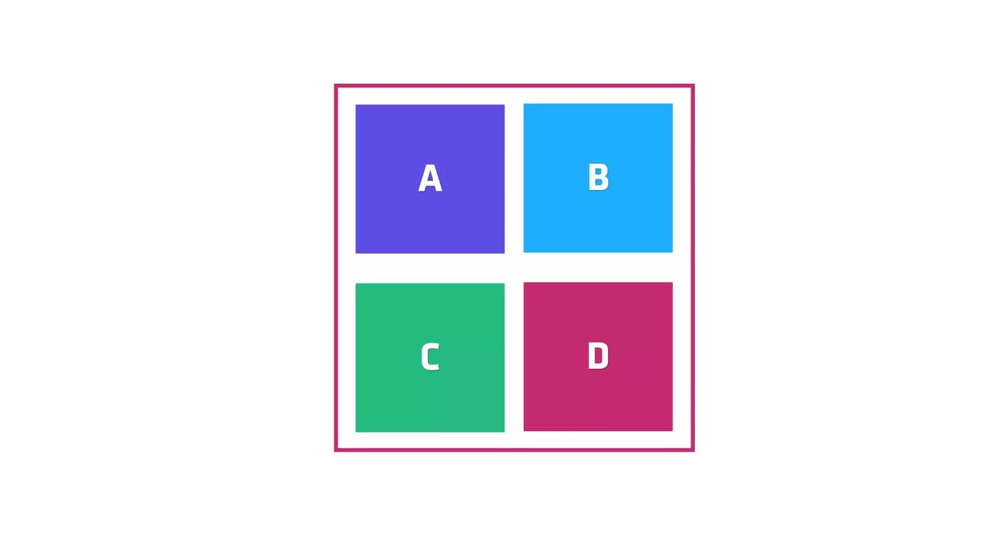

layout: true
class: img-caption
background-image: url(./assets/images/backgrounds/HashiCorp-Content-bkg.png)
background-size: cover
name: slide1

## Understanding the Traditional Monolith Application

???
Here is our traditional monolith application structure:

Single application we deploy, but has multiple sub components

Even though these are independent components we are packaging and deploying as a single unit

This creates limitations in development speed, scalability and reliability

In the event of a bug in component A:
Even if the responsible developer can quickly produce a fix, they must coordinate with the teams working on every other component before a deployment of the solution can be done

Component scale is static! If it is overtaxed, there is no way to scale its function without further redesign.

If there is an error in one component it may affect the entire application's reliability

These limitations have led to a new approach to application design in the form of Microservices

---
