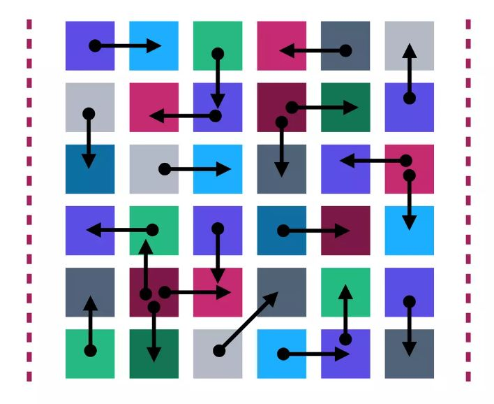

layout: true
class: img-right
background-image: url(./assets/images/backgrounds/HashiCorp-Content-bkg.png)
background-size: cover
name: slide3

## Microservice Architecture - Operational Complexity

 
Microservice architecture creates a unique set of challenges around:
* Discovery
* Configuration
* Segmentation

???

However, as in everything in life, there is trade offs that come with the benefits of a microservice design. Particularly there is added operational complexity for services around:
- Discovery
- Configuration
- Segmentation

A service mesh presents us a solution for the increased operation complexity of designing in a microservice world

---
