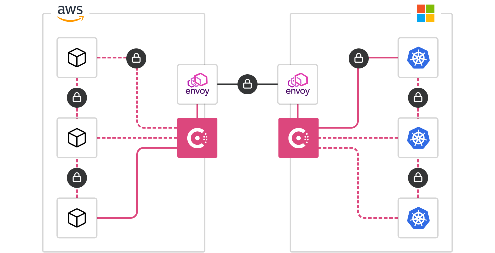

layout: true
class: 
background-image: url(./assets/images/backgrounds/HashiCorp-Content-bkg.png)
background-size: cover
name: slide4

## What is a Service Mesh?

???

A service mesh is a dedicated infrastructure layer that controls service-to-service communication over a network. A service mesh enables separate parts of an application to communicate with each other efficiently and securely. Generally this is done through the use of lightweight network proxies that are deployed alongside the application code. Facilitating the communication between microservices without the need for them to be aware of each other.

Let's quickly dive into Consul, Hashicorp's service mesh solution and how it approaches the operational complexity of microservice architecture

---
